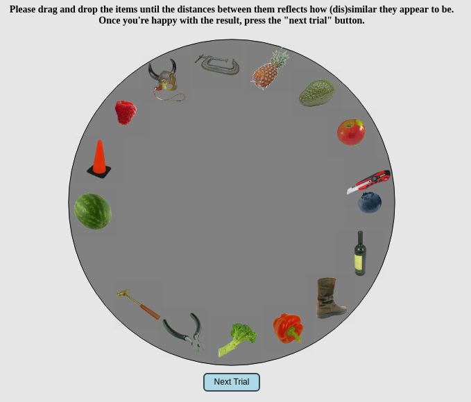
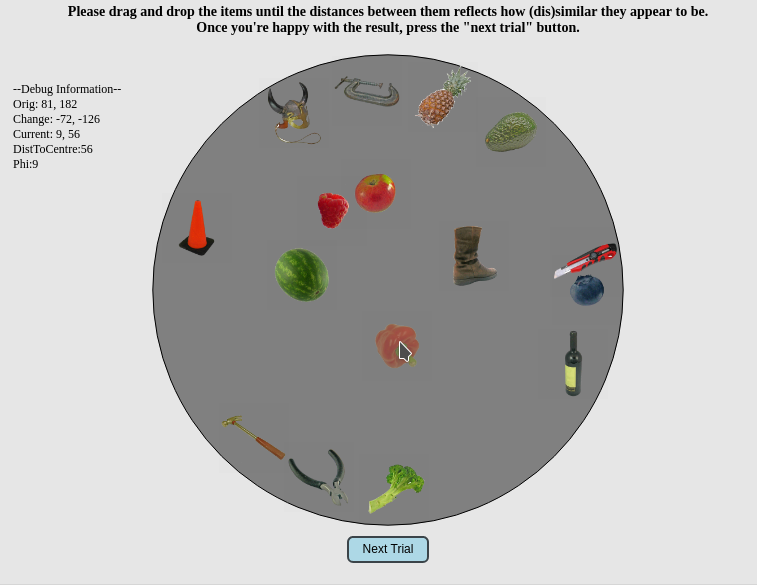

# JS Template for Dissimilarity Ratings
I wrote a JavaScript template to perform experiments which involve dissimilarity ratings of multiple stimuli.   
The code is modularized and allows easy customisation and integration in existing (Amazon MTurk) experiments. 
Participant Data is recorded throughout the session and stored as JSON file on the server (requires PHP).
## Overview 
On each trial, a set of stimuli are displayed in a circle on a two-dimensional canvas.    
<!--   -->
 </img>  
The participants are instructed to drag and drop the items on this surface, until the pairwise distances between all items reflects the subjectively perceived (dis)similarity. It's not possible to move the items out of the circular area. Once the participant is satisfied with the arrangement he/she continues with the next trial via button press. The script ends automatically and stores the data on the server once the predefined number of trials has been reached.   
<!--   -->
 </img>     
All sample stimuli are taken from the [CNBC Bank of Standarized Stimuli dataset](http://wiki.cnbc.cmu.edu/BOSS)
## Requirements - Server
The minimal setup required to run this template is an apache2 server with PHP. 
#### "Installation":
1. from the main folder, run 
``` bash
chmod -R 777 data
```
2. open a browser and open stimeval_page.html, which is located in the html subfolder
3. click your way through the demo and be delighted that everything works straight out of the box. 

## Requirements - Clients
Desktop and Touchscreen Devices are currently supported.  
The demo was tested on Macs, Linux and Windows notebooks with safari /google chrome and on Ipads and Android Devices. No issues were detected.


## Customisation
Usually, the experimenter only needs to adapt the arena_parameters.js and arena_stimuli.js files and change the title and instruction text in the stimeval_page.html file.  
### JS Modules

#### arena_main.js
This is the main function which sets up the canvas and populates the arena with stimuli
#### arena_parameters.js
All experiment, stimulus and UI related parameters are defined here
#### arena_dragndrop.js
the drag and drop mechanism is defined in this file. Based on raphaeljs
#### arena_stimuli.js
stimulus and trial related definitions are taking place in here
#### arena_goto.js
This file defines trial-to-trial transitions 
#### arena_userinterface.js
The arena itself and buttons are defined in this file
#### arena_expt.js
defines data export 
#### arena_draw.js
defines how the arena is populated with stimuli

### Style
Further customisations are possible via the files contained in the css and html folders. 

### Data Storage
log files are handled via the arena_expt.js and io.php script and stored as JSON files in data/final/


